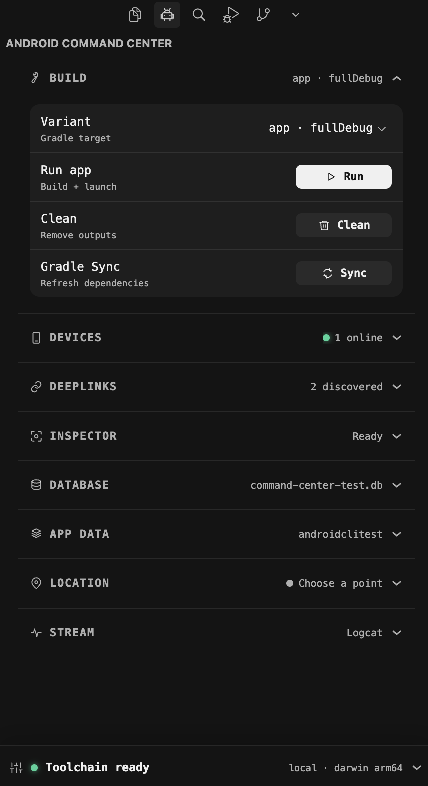
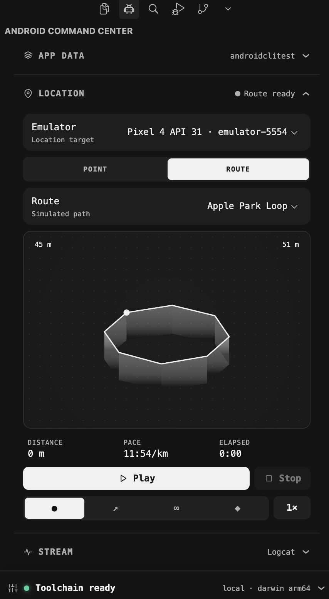

# Android Command Center

A Cursor/VS Code activity-bar panel for everyday Android development without opening Android Studio. Build, launch, inspect, and control Android apps from one compact, theme-aware sidebar.

> Android Command Center is currently a preview release. Please report unexpected behavior through the project issue tracker.

## In action

<p align="center">
  
  
</p>

<p align="center"><em>Build, run, and maintain your project — then simulate location routes without leaving the editor.</em></p>

## Quick start

1. Install the extension and open an Android project in VS Code or Cursor. If you open a parent monorepo folder, set `androidCli.projectRoot` to the Android app directory that contains `gradlew`.
2. Select the Android robot in the activity bar.
3. Review the **Toolchain** section and prepare or select any missing tools.
4. Choose a Gradle variant, select one or more active deployment targets, and click **Run**. Start inactive emulators from **Devices** first.

## Requirements

Android Command Center uses the tools installed in the environment where its VS Code/Cursor extension host is running. For local work that is your computer; in SSH, WSL, or a dev container, install them in that remote environment.

- Android CLI for running apps, emulators, screenshots, and layout inspection
- Android SDK platform tools (`adb`) for connected devices, deeplinks, logcat, themes, and location simulation
- A project Gradle wrapper (`gradlew` or `gradlew.bat`) for Sync, Run, and Clean
- SQLite 3 (`sqlite3`) for Database inspection

The dashboard detects each dependency and offers setup actions when one is unavailable. You can also set `androidCli.executable`, `androidCli.adbExecutable`, and `androidCli.sqliteExecutable` to absolute paths, and `androidCli.projectRoot` when the workspace folder is not the Gradle project root.

## Features

- Detect the Android CLI, SDK, connected devices, and virtual devices
- Select one or more active devices or emulators, then build once and install/launch on each target
- Select discovered Gradle build variants, sync dependencies, run apps, or clean the project
- Open deeplinks inline with manifest-discovered prefixes, per-workspace history, and favorites
- Retain the webview when hidden and show cached state or a skeleton while refreshing
- See available and connected devices together, start or stop emulators independently, and switch device light/dark mode
- Capture normal or annotated screenshots, preview them in the panel, and choose where to save them
- Set an arbitrary emulator GPS coordinate or simulate movement along a route
- Open filtered-device logcat
- Inspect SQLite / Room databases for debuggable apps, run SQL, edit cells, and push changes back to the device
- Clear app cache or storage and force-stop installed packages on a connected device

The extension deliberately does not wrap `android studio ...` commands: those require a running Android Studio instance. Kotlin language intelligence should be supplied by a VS Code language-server extension.

## Privacy and command execution

Android Command Center does not require an account or send project data to a hosted service. It invokes the Android CLI, ADB, Gradle wrapper, and SQLite tools in the extension-host environment. Interactive and long-running commands open in the integrated terminal so you can inspect or cancel them.

Destructive app-data actions identify the selected device and package and require confirmation where appropriate. Database editing is intended for debuggable apps and uses disposable working copies in VS Code/Cursor's private extension storage. Android Command Center does not create runtime folders in your project.

## Develop

```sh
npm install
npm run compile
```

Open this repository as a folder in Cursor, select **Run and Debug → Run Android Command Center — real tools**, and press `F5`. A second Cursor window opens as the Extension Development Host with `AndroidCliTestApp`; open the Android icon in that window's activity bar. If `F5` is captured by macOS, use **Run → Start Debugging** or `fn`+`F5`.

For automated checks, real-emulator journeys, and deterministic missing-tool/device scenarios, see [TESTING.md](TESTING.md). The complete release matrix is in [TEST_PLAN.md](TEST_PLAN.md), and failures are tracked in [BUGS.md](BUGS.md).

## Architecture

The webview is presentation-only. Extension-host code invokes the CLI with argument arrays (no shell), while interactive Gradle, emulator, and logcat processes run visibly in integrated terminals. This keeps long-running work cancellable and makes every developer-initiated command inspectable.

## Roadmap

1. Parse `android describe` into build-target and artifact pickers.
2. Add a structured layout-tree inspector with click-to-highlight.
3. Add Journey authoring/running and test result views.
4. Add device actions (rotation, permissions, recordings).
5. Expose stable VS Code commands so agents and tasks can trigger the same workflows.

## Database inspector

Inspect SQLite / Room databases for **debuggable** apps without Android Studio:

1. Open the **Database** section and choose a device.
2. **Scan apps** to list packages that allow `run-as` (debug builds).
3. Pick a process and database, browse tables, run SQL, or click a cell to edit.
4. Mutating statements and cell edits are applied locally then **pushed** back to the device. Use **Push** if you need to retry a write.

Working copies live in private, workspace-scoped extension storage and are cleaned automatically. Opening the dashboard only discovers database metadata; a database is copied after you interact with the **Database** section. If the app already has the DB open, force-stop or relaunch it after a push so it reloads from disk.
